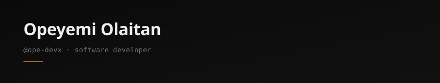

&nbsp;

I'm Opeyemi — a Software Developrt who builds tools that solve real problems for real people.

Not demos. Not tutorials. Software in production, used daily.

I design and ship web products for small businesses — primarily in Nigeria's food and restaurant industry — and build internal tools that people depend on to run their operations. My work sits at the intersection of **clean frontend experiences** and **robust backend systems**, with a growing focus on **AI-powered features** that make apps smarter.

&nbsp;

## What I've shipped

<table>
<tr>
<td width="50%">

### 🍍 Pineapple
**Mobile-first solar sales CRM — in active production use**

Built for a door-to-door field agent managing 20+ clients with no laptop access. Replaced a WhatsApp-notes workaround with a proper system: client pipeline tracking, appointment booking, price history logging, one-tap WhatsApp messaging.

`React 19` `FastAPI` `PostgreSQL` `Tailwind CSS v4` `PWA` `Supabase`

[Frontend →](https://github.com/ope-devx/PINEAPPLE_FRONTEND) · [Backend →](https://github.com/ope-devx/PINEAPPLE-BACKEND)

</td>
<td width="50%">

### 🎯 Prospect Tracker
**AI-powered freelance sales CRM**

My own business tool. Tracks prospects, qualifies leads, and uses AI (via OpenRouter) to generate cold DMs and follow-up messages tailored to each prospect's profile.

`React` `FastAPI` `PostgreSQL` `OpenRouter API` `Tailwind CSS` `Vite`

[Frontend →](https://github.com/ope-devx/PROSPECT-TRACKER-FRONTEND) · [Backend →](https://github.com/ope-devx/PROSPECT-TRACKER-BACKEND)

</td>
</tr>
<tr>
<td width="50%">

### 🗣️ Debate Arena
**AI-powered debate simulator**

Pick a topic, choose two AI models, and watch them argue both sides in real time. First project integrating a live LLM API — built to understand how AI model interactions work under the hood.

`React` `OpenRouter API` `React Router` `localStorage`

[Repo →](https://github.com/ope-devx/debate-arena)

</td>
<td width="50%">

### 🍽️ Client Websites
**Production sites for food businesses**

I run a web design practice building websites for Nigerian restaurants and food businesses. Shipped and deployed client sites including full CMS integration, brand-aligned design systems, and menu management.

`React` `Tailwind CSS` `Sveltia CMS` `Netlify` `Vercel`

[Portfolio →](https://ope-devx-portfolio.vercel.app)

</td>
</tr>
</table>

&nbsp;

## Stack

**Frontend** — React · Tailwind CSS · Vite · React Router · PWA  
**Backend** — FastAPI · Python · PostgreSQL · Supabase  
**AI / APIs** — OpenRouter · LLM APIs  
**Deploy** — Vercel · Render · Netlify  

&nbsp;

## Right now

- 🔧 Building full-stack products with **FastAPI + PostgreSQL + React**
- 🤖 Integrating **LLM APIs** into production tools
- 📚 Working through a self-directed **AI Application Engineering** roadmap — RAG, agents, and production AI systems
- 🎓 300-level **Computer Science** student at the Air Force Institute of Technology

&nbsp;

## Let's connect

**Portfolio** — [ope-devx-portfolio.vercel.app](https://ope-devx-portfolio.vercel.app)  
**Email** — johnolaitan22@gmail.com  
**GitHub** — You're already here.

&nbsp;

## My Socials

  &nbsp;&nbsp;&nbsp;
  &nbsp;&nbsp;&nbsp;
  &nbsp;&nbsp;&nbsp;

